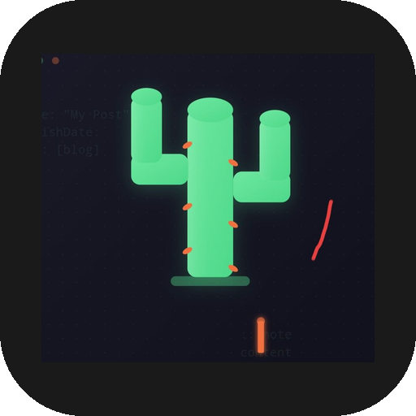

<div align="center">



# Cactus Editor

**Mobile CMS for [Astro Cactus](https://github.com/chrismwilliams/astro-theme-cactus) blogs**

Write, edit and publish directly from your phone — no computer, no code, no friction.

[](https://github.com/retired64/retired64.github.io/releases/tag/v1.0.0)
[](https://github.com/retired64/retired64.github.io/releases)
[](LICENSE)

---

| Login | Posts | Notas | Tags | Editor |
|:---:|:---:|:---:|:---:|:---:|
|  |  |  |  |  |

</div>

---

## What is this?

Cactus Editor connects to your GitHub repository and lets you manage your Astro Cactus blog from anywhere. Write a post on the bus, fix a typo from your couch, add a tag while waiting in line — when you hit publish, GitHub Actions handles the rest and your site goes live automatically.

No terminal. No text editor aditional. No laptop required.

---

## Installation

Download the latest APK from [Releases](https://github.com/retired64/retired64.github.io/releases/tag/v1.0.0) and install it on your Android device.

> You may need to allow installation from unknown sources in your device settings.

---

## Setup

On first launch you'll need three things:

| Field | Example |
|---|---|
| GitHub username | `retired64` |
| Repository name | `retired64.github.io` |
| Personal Access Token | `ghp_xxxxxxxxxxxx` |

Your token is stored securely in the device keychain — never in plain text, never shared.

To generate a token: GitHub → Settings → Developer settings → Personal access tokens → Fine-grained → Contents (read & write).

---

## Features

### Content management

Three tabs cover everything in your blog:

- **Posts** — full articles with frontmatter, tags, cover images and OG metadata
- **Notes** — shorter content: TILs, quick thoughts, brief entries
- **Tags** — create and manage the labels that organize your content

Each section has instant search by title and tags, plus deep search that scans inside the body of your posts.

### Editor

The Markdown editor includes syntax highlighting, line numbers, find & replace, pinch-to-zoom, and word wrap toggle. A live **Preview** tab renders your content exactly as it will appear on your blog — same colors, same code highlighting (Dracula dark / GitHub light), same admonitions and GitHub cards.

### Snippets

One tap inserts ready-to-use Markdown blocks:

**Text** — headings H2–H4, bold, italic, strikethrough, inline code, links, images, blockquotes, footnotes, tables, `<kbd>` keys

**Code** — bash, JavaScript, TypeScript, Dart, Python, YAML; blocks with filename, diff view, or highlighted lines

**Astro Cactus components** — the ones that actually render on your blog:

| Snippet | Result |
|---|---|
| `:::note` | Blue info box |
| `:::tip` | Green tip box |
| `:::important` | Purple highlight |
| `:::warning` | Red warning |
| `:::caution` | Orange caution |
| `::github{repo="user/repo"}` | Repository card |
| `::github{user="username"}` | User profile card |

> Select text before inserting a snippet and it wraps automatically around your selection.

### Offline & drafts

No internet? Keep writing. Save locally with one tap and sync when you're back online. If a publish fails due to no connection, the app saves a draft automatically and shows you when it happened. Drafts appear in a separate section with clear indicators — new, modified, or time since last save.

### Post metadata

Everything Astro Cactus expects, all in one form:

| Field | Notes |
|---|---|
| Title | 60 char limit |
| Slug | Auto-generated from title, editable |
| Description | 50–160 chars, used for SEO and social previews |
| Publish date | Defaults to today |
| Update date | Optional |
| Tags | Type and press Enter; drag to reorder |
| Draft | Hides from your live site |
| Pinned | Appears in featured section (max 3) |
| Cover image | Path + alt text |
| OG image | Social share image |

### How publishing works

```
Write in app  →  Tap Publish  →  File pushed via GitHub API
                                         ↓
                              GitHub Actions triggered
                                         ↓
                         Astro builds site + Pagefind index
                                         ↓
                              Live on GitHub Pages
```

One tap. Done.

---

## Settings

Tap the gear icon to switch language (Spanish / English), view your connected repository, or disconnect and link a different account.

---

## Built with

- [Flutter](https://flutter.dev)
- [GitHub REST API](https://docs.github.com/en/rest)
- [Astro Cactus](https://github.com/chrismwilliams/astro-theme-cactus)

---

<div align="center">

Made by [retired64](https://github.com/retired64)

</div>
